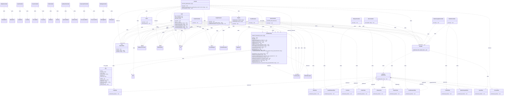

#SAE-S3-2026-27 Cyberlab

```mermaid
classDiagram

    %% ===== Classes à développer =====

    %% À FAIRE : Module
    %% À FAIRE : Level
    %% À FAIRE : Course
    %% À FAIRE : Test
    %% À FAIRE : Synthesis
    %% À FAIRE : Assessment
    %% À FAIRE : Ranking

    class ModuleModel
    class ModuleView
    class ModuleController

    class LevelModel
    class LevelView
    class LevelController

    class CourseModel
    class CourseView
    class CourseController

    class TestModel
    class TestView
    class TestController

    class SynthesisModel
    class SynthesisView
    class SynthesisController

    class AssessmentModel
    class AssessmentView
    class AssessmentController

    class RankingModel
    class RankingView
    class RankingController

    class User {
        -id: ?int;
        -username: string;
        -email: string;
        -passwordHash: ?string;
        -nbPoints: int;
        -progression: float;
        +getId(): ?int
        +getUsername(): string
        +getEmail(): string
        +getPasswordHash(): ?string
        +getPoints(): int
        +getProgression(): float
    }

    class UserRepository {
        -DUMMY_PASSWORD_HASH: string$;
        -getPdo(): PDO;
        +countAll(): int
        +findRankingPage(limit: int, offset: int): array
        +findByUsername(username: string): ?User
        +findByEmail(email: string): ?User
        +findById(userId: int): ?User
        +findByUsernameOrEmail(identifier: string): ?User
        +findUserByResetToken(tokenHash: string): ?User
        +usernameExists(username: string): bool
        +emailExists(email: string): bool
        +idExists(userId: int): bool
        +tokenExists(tokenHash: string): bool
        +createUser(username: string, email: string, password: string, passwordConfirm: string): void
        +login(identifier: string, password: string): User
        +emailDomainExists(email: string): bool
        +createPasswordReset(userId: int, tokenHash: string, expiresAt: int): void
        +deletePasswordReset(tokenHash: string): void
        +updateUsername(userId: int, username: string): void
        +checkPassword(userId: int, password: string): void
        +updateEmail(userId: int, email: string): void
        +deleteUser(userId: int): void
        +updatePassword(userId: int, password: string, passwordConfirm: string): void
    }

    class Account {
        -SUCCESS_MESSAGES: array$;
        +execute(): void
        -handleForm(userRepository: UserRepository, userId: int, form: string): void
        -redirect(updated: string): never
    }

    class AProposController {
        +execute(): void
    }

    class ContactController {
        +contact(): void
    }

    class ErrorController {
        +execute(title: string): void
    }

    class ForgotPassword {
        +execute(): void
        -setting(key: string, default: string): string
        -sendResetEmail(email: string, token: string): void
    }
    
    class HomeController {
        -PLAYERS_PER_PAGE: int$;
        +execute(): void
    }

    class Login {
        -MAX_ATTEMPTS: int$;
        -LOCK_SECONDS: int$;
        -NOTICES: array$;
        +execute(): void
        -notice(): ?string
        -attemptsFile(identifier: string): string
        -readAttempts(identifier: string): array
        -lockRemaining(identifier: string): int
        -recordFailure(identifier: string): void
        -clearAttempts(identifier: string): void
    }

    class Logout {
        +execute(): void
        +destroySession(): void
    }

    class MentionsLegalesController {
        +execute(): void
    }

    class PlanSiteController {
        +execute(): void
    }

    class Register {
        +USERNAME_PATTERN: string$;
        +USERNAME_RULES: string$;
        +execute(): void
    }

    class RequestInput {
        <<trait>>
        -isPost(): bool
        -post(key: string): string
        -query(key: string): string
    }

    class ResetPassword {
        +execute(): void
    }

    class ViewInterface {
        <<interface>>
        +render(params: array): void
    }

    class AccountView {
        +render(array params): void
    }

    class AProposView {
        +render(array params): void
    }

    class ContactView {
        +render(array params): void
    }

    class ErrorView {
        +render(array params): void
    }

    class ForgotPasswordView {
        +render(array params): void
    }

    class HomeView {
        +render(array params): void
    }

    class LayoutView {
        +render(array params): void
    }

    class LoginView {
        +render(array params): void
    }

    class MentionsLegalesView {
        +render(array params): void
    }

    class PlanSiteView {
        +render(array params): void
    }

    class RegisterView {
        +render(array params): void
    }

    class ResetPasswordView {
        +render(array params): void
    }

    class Template {
    +render(view: string, params: array): void$
    }

    class PDO
    class UserException
    class RuntimeException

    UserRepository ..> User : crée et utilise
    UserRepository ..> RuntimeException : déclenche
    UserRepository ..> PDO : utilise
    UserRepository ..> UserException : déclenche

    Account ..> RequestInput : utilise trait
    Account ..> DatabaseConnection : utilise
    Account ..> UserRepository : crée et utilise
    Account ..> UserException : déclenche / intercepte
    Account ..> PDOException : intercepte
    Account ..> Csrf : utilise
    Account ..> SessionHelpers : utilise
    Account ..> Template : utilise
    Account ..> AccountView : référence
    Account ..> Logout : utilise
    Account ..> Register : utilise

    AProposController ..> Template : utilise
    AProposController ..> AProposView : utilise

    ContactController ..> Csrf : utilise
    ContactController ..> DatabaseConnection : utilise
    ContactController ..> PDOException : utilise
    ContactController ..> Template : utilise
    ContactController ..> ContactView : utilise
    ContactController ..> PDO : utilise

    ErrorController ..> Template : utilise
    ErrorController ..> ErrorView : utilise

    ForgotPassword ..> RequestInput : utilise
    ForgotPassword ..> PDOException : utilise
    ForgotPassword ..> Csrf : utilise
    ForgotPassword ..> UserRepository : utilise
    ForgotPassword ..> DatabaseConnection : utilise
    ForgotPassword ..> UserException : utilise
    ForgotPassword ..> RandomException : utilise
    ForgotPassword ..> Template : utilise
    ForgotPassword ..> ForgotPasswordView : utilise

    HomeController ..> UserRepository : utilise
    HomeController ..> DatabaseConnection : utilise
    HomeController ..> Template : utilise
    HomeController ..> HomeView : utilise
    HomeController ..> Pagination : utilise
    HomeController ..> SessionHelpers : utilise

    Login ..> RequestInput : utilise
    Login ..> SessionHelpers : utilise
    Login ..> Csrf : utilise
    Login ..> UserRepository : utilise
    Login ..> DatabaseConnection : utilise
    Login ..> UserException : utilise
    Login ..> PDOException : utilise
    Login ..> Template : utilise
    Login ..> LoginView : utilise

    Logout ..> RequestInput : utilise
    Logout ..> Csrf : utilise

    MentionsLegalesController ..> Template : utilise
    MentionsLegalesController ..> MentionsLegalesView : utilise

    PlanSiteController ..> Template : utilise
    PlanSiteController ..> PlanSiteView : utilise

    Register ..> RequestInput : utilise
    Register ..> SessionHelpers : utilise
    Register ..> Csrf : utilise
    Register ..> UserRepository : utilise
    Register ..> DatabaseConnection : utilise
    Register ..> UserException : utilise
    Register ..> PDOException : utilise
    Register ..> Template : utilise
    Register ..> RegisterView : utilise

    ResetPassword ..> RequestInput : utilise
    ResetPassword ..> DatabaseConnection : utilise
    ResetPassword ..> UserRepository : utilise
    ResetPassword ..> PDOException : utilise
    ResetPassword ..> UserException : utilise
    ResetPassword ..> Csrf : utilise
    ResetPassword ..> Template : utilise
    ResetPassword ..> ResetPasswordView : utilise

    ViewInterface <|.. AccountView : implémente
    ViewInterface <|.. AProposView : implémente
    ViewInterface <|.. ContactView : implémente
    ViewInterface <|.. ErrorView : implémente
    ViewInterface <|.. ForgotPasswordView : implémente
    ViewInterface <|.. HomeView : implémente
    ViewInterface <|.. LayoutView : implémente
    ViewInterface <|.. LoginView : implémente
    ViewInterface <|.. MentionsLegalesView : implémente
    ViewInterface <|.. PlanSiteView : implémente
    ViewInterface <|.. RegisterView : implémente
    ViewInterface <|.. ResetPasswordView : implémente
    Template ..> LayoutView : utilise
    Template ..> ViewInterface : utilise

    ModuleController ..> ModuleModel : utilise
    ModuleController ..> ModuleView : utilise

    LevelController ..> LevelModel : utilise
    LevelController ..> LevelView : utilise

    CourseController ..> CourseModel : utilise
    CourseController ..> CourseView : utilise

    TestController ..> TestModel : utilise
    TestController ..> TestView : utilise

    SynthesisController ..> SynthesisModel : utilise
    SynthesisController ..> SynthesisView : utilise

    AssessmentController ..> AssessmentModel : utilise
    AssessmentController ..> AssessmentView : utilise

    RankingController ..> RankingModel : utilise
    RankingController ..> RankingView : utilise

```
    