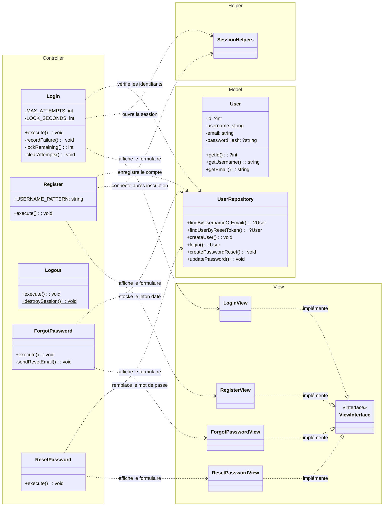

```mermaid

    classDiagram
    direction LR

    namespace Controller {
        class Login {
            -MAX_ATTEMPTS: int$
            -LOCK_SECONDS: int$
            +execute(): void
            -recordFailure(): void
            -lockRemaining(): int
            -clearAttempts(): void
        }

        class Register {
            +USERNAME_PATTERN: string$
            +execute(): void
        }

        class Logout {
            +execute(): void
            +destroySession(): void$
        }

        class ForgotPassword {
            +execute(): void
            -sendResetEmail(): void
        }

        class ResetPassword {
            +execute(): void
        }
    }

    namespace Model {
        class User {
            -id: ?int
            -username: string
            -email: string
            -passwordHash: ?string
            +getId(): ?int
            +getUsername(): string
            +getEmail(): string
        }

        class UserRepository {
            +findByUsernameOrEmail(): ?User
            +findUserByResetToken(): ?User
            +createUser(): void
            +login(): User
            +createPasswordReset(): void
            +updatePassword(): void
        }
    }

    namespace Helper {
        class SessionHelpers
    }

    namespace View {
        class ViewInterface {
            <<interface>>
        }
        class LoginView
        class RegisterView
        class ForgotPasswordView
        class ResetPasswordView
    }

    Login ..> UserRepository : vérifie les identifiants
    Register ..> UserRepository : enregistre le compte
    ForgotPassword ..> UserRepository : stocke le jeton daté
    ResetPassword ..> UserRepository : remplace le mot de passe

    Login ..> SessionHelpers : ouvre la session
    Register ..> SessionHelpers : connecte après inscription

    Login ..> LoginView : affiche le formulaire
    Register ..> RegisterView : affiche le formulaire
    ForgotPassword ..> ForgotPasswordView : affiche le formulaire
    ResetPassword ..> ResetPasswordView : affiche le formulaire

    LoginView ..|> ViewInterface : implémente
    RegisterView ..|> ViewInterface : implémente
    ForgotPasswordView ..|> ViewInterface : implémente
    ResetPasswordView ..|> ViewInterface : implémente

```