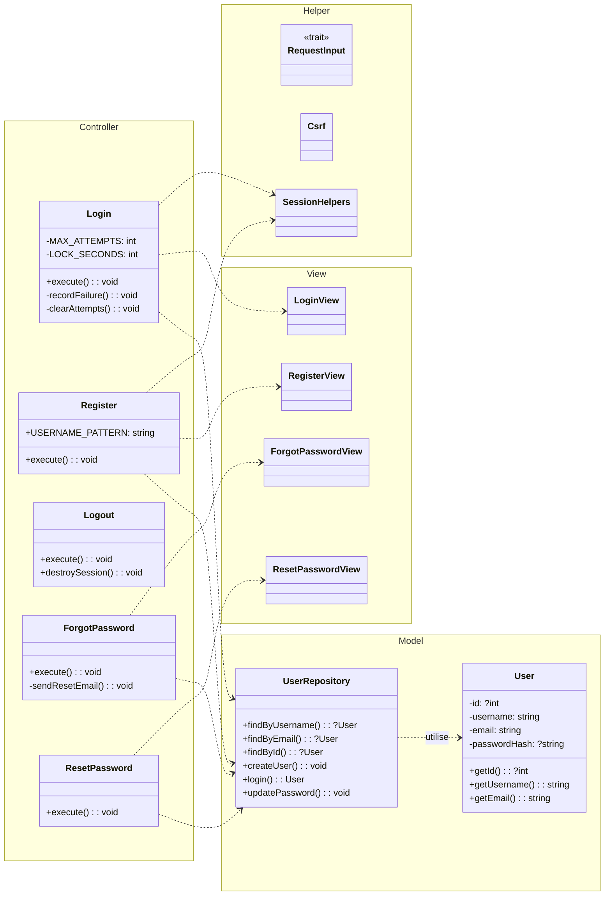

```mermaid
   
classDiagram
    direction LR

    namespace Controller {
        class Login {
            -MAX_ATTEMPTS: int
            -LOCK_SECONDS: int
            +execute(): void
            -recordFailure(): void
            -clearAttempts(): void
        }

        class Register {
            +USERNAME_PATTERN: string
            +execute(): void
        }

        class Logout {
            +execute(): void
            +destroySession(): void
        }

        class ForgotPassword {
            +execute(): void
            -sendResetEmail(): void
        }

        class ResetPassword {
            +execute(): void
        }
    }

    namespace Model {
        class User {
            -id: ?int
            -username: string
            -email: string
            -passwordHash: ?string
            +getId(): ?int
            +getUsername(): string
            +getEmail(): string
        }

        class UserRepository {
            +findByUsername(): ?User
            +findByEmail(): ?User
            +findById(): ?User
            +createUser(): void
            +login(): User
            +updatePassword(): void
        }
    }

    namespace Helper {
        class RequestInput {
            <<trait>>
        }
        class Csrf
        class SessionHelpers
    }

    namespace View {
        class LoginView
        class RegisterView
        class ForgotPasswordView
        class ResetPasswordView
    }

    UserRepository ..> User : utilise

    Login ..> UserRepository
    Register ..> UserRepository
    ForgotPassword ..> UserRepository
    ResetPassword ..> UserRepository

    Login ..> LoginView
    Register ..> RegisterView
    ForgotPassword ..> ForgotPasswordView
    ResetPassword ..> ResetPasswordView

    Login ..> SessionHelpers
    Register ..> SessionHelpers

```