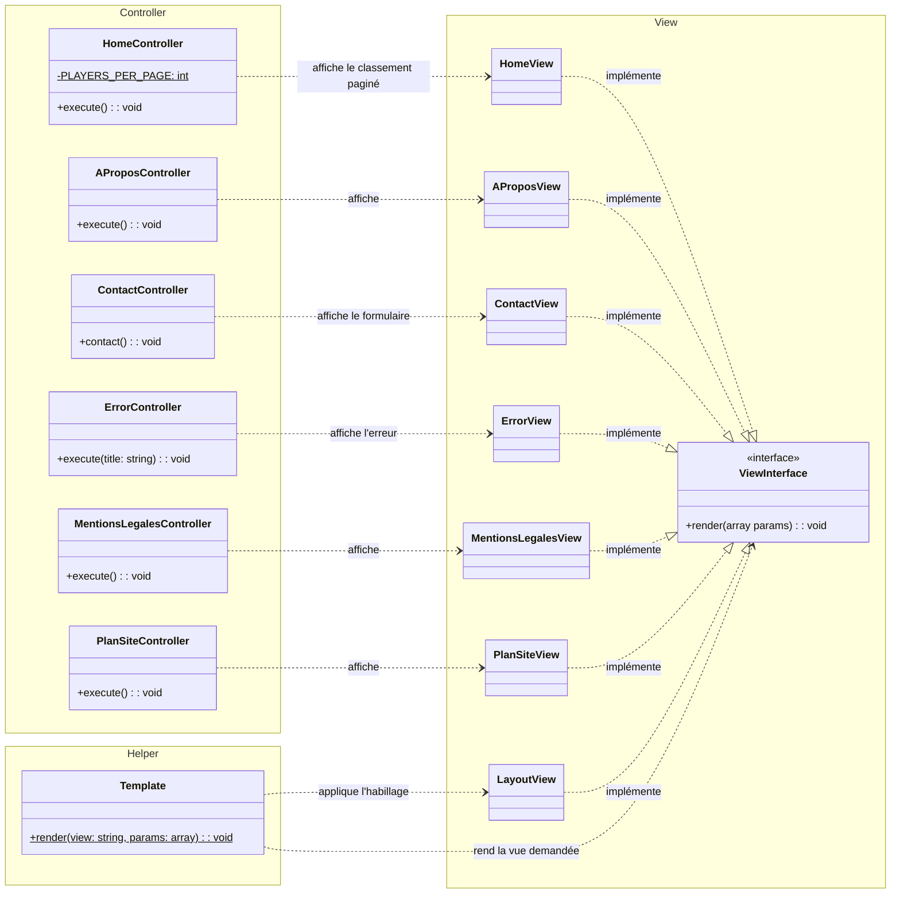

```mermaid

    classDiagram
    direction LR

    namespace Controller {
        class HomeController {
            -PLAYERS_PER_PAGE: int$
            +execute(): void
        }

        class AProposController {
            +execute(): void
        }

        class ContactController {
            +contact(): void
        }

        class ErrorController {
            +execute(title: string): void
        }

        class MentionsLegalesController {
            +execute(): void
        }

        class PlanSiteController {
            +execute(): void
        }
    }

    namespace View {
        class ViewInterface {
            <<interface>>
            +render(array params): void
        }

        class LayoutView
        class HomeView
        class AProposView
        class ContactView
        class ErrorView
        class MentionsLegalesView
        class PlanSiteView
    }

    namespace Helper {
        class Template {
            +render(view: string, params: array): void$
        }
    }

    HomeController ..> HomeView : affiche le classement paginé
    AProposController ..> AProposView : affiche
    ContactController ..> ContactView : affiche le formulaire
    ErrorController ..> ErrorView : affiche l'erreur
    MentionsLegalesController ..> MentionsLegalesView : affiche
    PlanSiteController ..> PlanSiteView : affiche

    HomeView ..|> ViewInterface : implémente
    AProposView ..|> ViewInterface : implémente
    ContactView ..|> ViewInterface : implémente
    ErrorView ..|> ViewInterface : implémente
    MentionsLegalesView ..|> ViewInterface : implémente
    PlanSiteView ..|> ViewInterface : implémente
    LayoutView ..|> ViewInterface : implémente

    Template ..> ViewInterface : rend la vue demandée
    Template ..> LayoutView : applique l'habillage

```