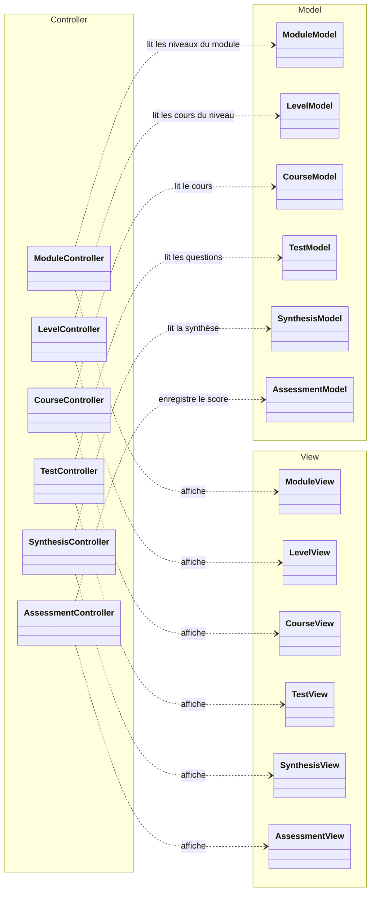

```mermaid

    classDiagram
    direction LR

    namespace Controller {
        class ModuleController
        class LevelController
        class CourseController
        class TestController
        class SynthesisController
        class AssessmentController
    }

    namespace Model {
        class ModuleModel
        class LevelModel
        class CourseModel
        class TestModel
        class SynthesisModel
        class AssessmentModel
    }

    namespace View {
        class ModuleView
        class LevelView
        class CourseView
        class TestView
        class SynthesisView
        class AssessmentView
    }

    ModuleController ..> ModuleModel : lit les niveaux du module
    ModuleController ..> ModuleView : affiche
    LevelController ..> LevelModel : lit les cours du niveau
    LevelController ..> LevelView : affiche
    CourseController ..> CourseModel : lit le cours
    CourseController ..> CourseView : affiche
    TestController ..> TestModel : lit les questions
    TestController ..> TestView : affiche
    SynthesisController ..> SynthesisModel : lit la synthèse
    SynthesisController ..> SynthesisView : affiche
    AssessmentController ..> AssessmentModel : enregistre le score
    AssessmentController ..> AssessmentView : affiche

```