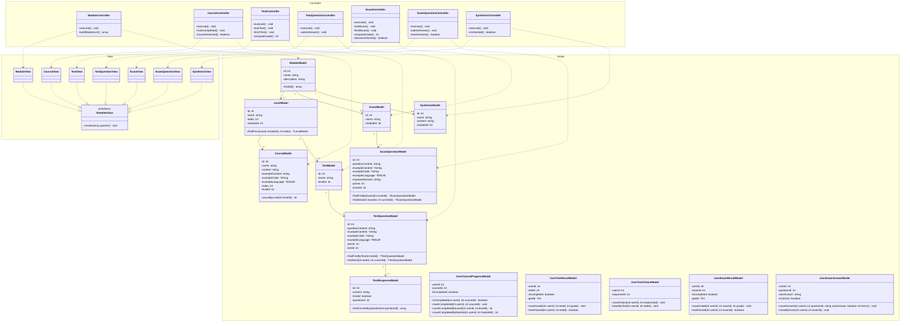

```mermaid
classDiagram
    direction TB

    namespace Controller {
        class ModuleController {
            +execute() void
            -buildModuleList() array
        }
        class CourseController {
            +execute() void
            -markCompleted() void
            -isLevelUnlocked() boolean
        }
        class TestController {
            +execute() void
            -startTest() void
            -finishTest() void
            -computeGrade() int
        }
        class TestQuestionController {
            +execute() void
            -submitAnswer() void
        }
        class ExamController {
            +execute() void
            -startExam() void
            -finishExam() void
            -computeGrade() int
            -isExamUnlocked() boolean
        }
        class ExamQuestionController {
            +execute() void
            -submitAnswer() void
            -checkAnswer() boolean
        }
        class SynthesisController {
            +execute() void
            -isUnlocked() boolean
        }
    }

    namespace Model {
        class ModuleModel {
            -id: int
            -name: string
            -description: string
            +findAll() array
        }
        class LevelModel {
            -id: int
            -name: string
            -index: int
            -moduleId: int
            +findPrevious(int moduleId, int index) ?LevelModel
        }
        class CourseModel {
            -id: int
            -name: string
            -content: string
            -exampleContent: string
            -exampleCode: ?string
            -exampleLanguage: ?ENUM
            -index: int
            -levelId: int
            +countByLevel(int levelId) int
        }
        class SynthesisModel {
            -id: int
            -name: string
            -content: string
            -moduleId: int
        }
        class TestModel {
            -id: int
            -name: string
            -levelId: int
        }
        class TestQuestionModel {
            -id: int
            -questionContent: string
            -exampleContent: ?string
            -exampleCode: ?string
            -exampleLanguage: ?ENUM
            -points: int
            -testId: int
            +findFirstByTest(int testId) ?TestQuestionModel
            +findNext(int testId, int currentId) ?TestQuestionModel
        }
        class TestResponseModel {
            -id: int
            -content: string
            -isValid: boolean
            -questionId: int
            +findCorrectByQuestion(int questionId) array
        }
        class ExamModel {
            -id: int
            -name: string
            -moduleId: int
        }
        class ExamQuestionModel {
            -id: int
            -questionContent: string
            -exampleContent: ?string
            -exampleCode: ?string
            -exampleLanguage: ?ENUM
            -expectedAnswer: string
            -points: int
            -examId: int
            +findFirstByExam(int examId) ?ExamQuestionModel
            +findNext(int examId, int currentId) ?ExamQuestionModel
        }
        class UserCourseProgressModel {
            -userId: int
            -courseId: int
            -isCompleted: boolean
            +isCompleted(int userId, int courseId) boolean
            +markCompleted(int userId, int courseId) void
            +countCompletedByLevel(int userId, int levelId) int
            +countCompletedByModule(int userId, int moduleId) int
        }
        class UserTestResultModel {
            -userId: int
            -testId: int
            -isCompleted: boolean
            -grade: ?int
            +saveGrade(int userId, int testId, int grade) void
            +hasPassed(int userId, int testId) boolean
        }
        class UserTestChoiceModel {
            -userId: int
            -responseId: int
            +saveChoice(int userId, int responseId) void
            +clearByTest(int userId, int testId) void
        }
        class UserExamResultModel {
            -userId: int
            -examId: int
            -isCompleted: boolean
            -grade: ?int
            +saveGrade(int userId, int examId, int grade) void
            +hasPassed(int userId, int examId) boolean
        }
        class UserExamAnswerModel {
            -userId: int
            -questionId: int
            -userAnswer: string
            -isCorrect: boolean
            +saveAnswer(int userId, int questionId, string userAnswer, boolean isCorrect) void
            +clearByExam(int userId, int examId) void
        }
    }

    namespace View {
        class ViewInterface {
            <<interface>>
            +render(array params) void
        }
        class ModuleView
        class CourseView
        class TestView
        class TestQuestionView
        class ExamView
        class ExamQuestionView
        class SynthesisView
    }

    ModuleController ..> ModuleView
    CourseController ..> CourseView
    TestController ..> TestView
    TestQuestionController ..> TestQuestionView
    ExamController ..> ExamView
    ExamQuestionController ..> ExamQuestionView
    SynthesisController ..> SynthesisView

    ModuleView ..|> ViewInterface
    CourseView ..|> ViewInterface
    TestView ..|> ViewInterface
    TestQuestionView ..|> ViewInterface
    ExamView ..|> ViewInterface
    ExamQuestionView ..|> ViewInterface
    SynthesisView ..|> ViewInterface

    ModuleController ..> ModuleModel
    CourseController ..> CourseModel
    TestController ..> TestModel
    TestQuestionController ..> TestQuestionModel
    ExamController ..> ExamModel
    ExamQuestionController ..> ExamQuestionModel
    SynthesisController ..> SynthesisModel

    ModuleModel "1" --> "1..*" LevelModel
    LevelModel "1" --> "1..*" CourseModel
    LevelModel "1" --> "0..1" TestModel
    TestModel "1" --> "1..*" TestQuestionModel
    TestQuestionModel "1" --> "2..*" TestResponseModel
    ModuleModel "1" --> "0..1" ExamModel
    ExamModel "1" --> "1..*" ExamQuestionModel
    ModuleModel "1" --> "0..1" SynthesisModel
```