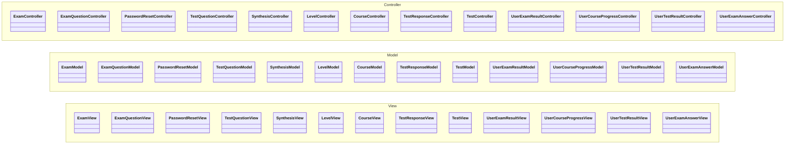

```mermaid

    classDiagram
    direction LR

    namespace Controller {
        class ExamController
        class ExamQuestionController
        class PasswordResetController
        class TestQuestionController
        class SynthesisController
        class LevelController
        class CourseController
        class TestResponseController
        class TestController
        class UserExamResultController
        class UserCourseProgressController
        class UserTestResultController
        class UserExamAnswerController
    }

    namespace Model {
        class ExamModel
        class ExamQuestionModel
        class PasswordResetModel
        class TestQuestionModel
        class SynthesisModel
        class LevelModel
        class CourseModel
        class TestResponseModel
        class TestModel
        class UserExamResultModel
        class UserCourseProgressModel
        class UserTestResultModel
        class UserExamAnswerModel
    }

    namespace View {
        class ExamView
        class ExamQuestionView
        class PasswordResetView
        class TestQuestionView
        class SynthesisView
        class LevelView
        class CourseView
        class TestResponseView
        class TestView
        class UserExamResultView
        class UserCourseProgressView
        class UserTestResultView
        class UserExamAnswerView
    }
```