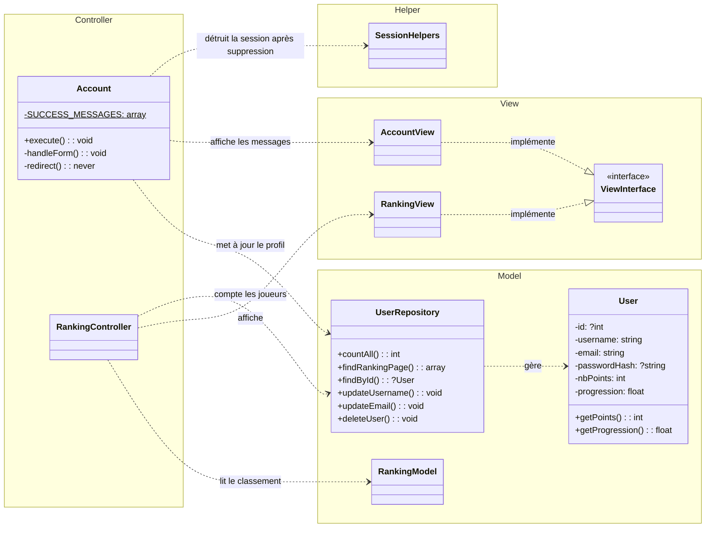

```mermaid

    classDiagram
    direction LR

    namespace Controller {
        class Account {
            -SUCCESS_MESSAGES: array$
            +execute(): void
            -handleForm(): void
            -redirect(): never
        }

        class RankingController
    }

    namespace Model {
        class User {
            -id: ?int
            -username: string
            -email: string
            -passwordHash: ?string
            -nbPoints: int
            -progression: float
            +getPoints(): int
            +getProgression(): float
        }

        class UserRepository {
            +countAll(): int
            +findRankingPage(): array
            +findById(): ?User
            +updateUsername(): void
            +updateEmail(): void
            +deleteUser(): void
        }

        class RankingModel
    }

    namespace Helper {
        class SessionHelpers
    }

    namespace View {
        class ViewInterface {
            <<interface>>
        }
        class AccountView
        class RankingView
    }

    Account ..> UserRepository : met à jour le profil
    Account ..> AccountView : affiche les messages
    Account ..> SessionHelpers : détruit la session après suppression

    RankingController ..> RankingModel : lit le classement
    RankingController ..> RankingView : affiche
    RankingController ..> UserRepository : compte les joueurs

    UserRepository ..> User : gère

    AccountView ..|> ViewInterface : implémente
    RankingView ..|> ViewInterface : implémente

```