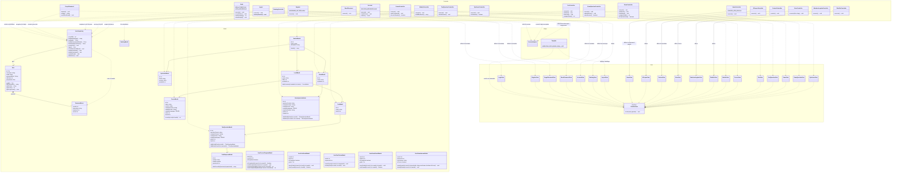

```mermaid
classDiagram
    direction TB

    namespace Controller {
        class Login {
            -MAX_ATTEMPTS: int$
            -LOCK_SECONDS: int$
            +execute(): void
            -recordFailure(): void
            -lockRemaining(): int
            -clearAttempts(): void
        }

        class Register {
            +USERNAME_PATTERN: string$
            +execute(): void
        }

        class Logout {
            +execute(): void
            +destroySession(): void$
        }

        class ForgotPassword {
            +execute(): void
            -setting(): string
            -sendResetEmail(): void
        }

        class ResetPassword {
            +execute(): void
        }

        class Account {
            -SUCCESS_MESSAGES: array$
            +execute(): void
            -handleForm(): void
            -redirect(): never
        }

        class RankingController

        class HomeController {
            -PLAYERS_PER_PAGE: int$
            +execute(): void
        }

        class AProposController {
            +execute(): void
        }

        class ContactController {
            +contact(): void
        }

        class ErrorController {
            +execute(title: string): void
        }

        class MentionsLegalesController {
            +execute(): void
        }

        class PlanSiteController {
            +execute(): void
        }

        class ModuleController {
            +execute(): void
            -buildModuleList(): array
        }

        class CourseController {
            +execute(): void
            -markCompleted(): void
            -isLevelUnlocked(): boolean
        }

        class TestController {
            +execute(): void
            -startTest(): void
            -finishTest(): void
            -computeGrade(): int
        }

        class TestQuestionController {
            +execute(): void
            -submitAnswer(): void
        }

        class ExamController {
            +execute(): void
            -startExam(): void
            -finishExam(): void
            -computeGrade(): int
            -isExamUnlocked(): boolean
        }

        class ExamQuestionController {
            +execute(): void
            -submitAnswer(): void
            -checkAnswer(): boolean
        }

        class SynthesisController {
            +execute(): void
            -isUnlocked(): boolean
        }
    }

    namespace Model {
        class User {
            -id: ?int
            -username: string
            -email: string
            -passwordHash: ?string
            -nbPoints: int
            -progression: float
            +getId(): ?int
            +getUsername(): string
            +getEmail(): string
            +getPoints(): int
            +getProgression(): float
        }

        class PasswordReset {
            -resetId: int
            -tokenHash: string
            -expiresAt: int
            -userId: int
        }

        class UserRepository {
            +countAll(): int
            +findRankingPage(): array
            +findById(): ?User
            +findByUsernameOrEmail(): ?User
            +findUserByResetToken(): ?User
            +createUser(): void
            +login(): User
            +createPasswordReset(): void
            +updatePassword(): void
            +updateUsername(): void
            +updateEmail(): void
            +deleteUser(): void
        }

        class RankingModel

        class ModuleModel {
            -id: int
            -name: string
            -description: string
            +findAll(): array
        }

        class LevelModel {
            -id: int
            -name: string
            -index: int
            -moduleId: int
            +findPrevious(int moduleId, int index): ?LevelModel
        }

        class CourseModel {
            -id: int
            -name: string
            -content: string
            -exampleContent: string
            -exampleCode: ?string
            -exampleLanguage: ?ENUM
            -index: int
            -levelId: int
            +countByLevel(int levelId): int
        }

        class SynthesisModel {
            -id: int
            -name: string
            -content: string
            -moduleId: int
        }

        class TestModel {
            -id: int
            -name: string
            -levelId: int
        }

        class TestQuestionModel {
            -id: int
            -questionContent: string
            -exampleContent: ?string
            -exampleCode: ?string
            -exampleLanguage: ?ENUM
            -points: int
            -testId: int
            +findFirstByTest(int testId): ?TestQuestionModel
            +findNext(int testId, int currentId): ?TestQuestionModel
        }

        class TestResponseModel {
            -id: int
            -content: string
            -isValid: boolean
            -questionId: int
            +findCorrectByQuestion(int questionId): array
        }

        class ExamModel {
            -id: int
            -name: string
            -moduleId: int
        }

        class ExamQuestionModel {
            -id: int
            -questionContent: string
            -exampleContent: ?string
            -exampleCode: ?string
            -exampleLanguage: ?ENUM
            -expectedAnswer: string
            -points: int
            -examId: int
            +findFirstByExam(int examId): ?ExamQuestionModel
            +findNext(int examId, int currentId): ?ExamQuestionModel
        }

        class UserCourseProgressModel {
            -userId: int
            -courseId: int
            -isCompleted: boolean
            +isCompleted(int userId, int courseId): boolean
            +markCompleted(int userId, int courseId): void
            +countCompletedByLevel(int userId, int levelId): int
            +countCompletedByModule(int userId, int moduleId): int
        }

        class UserTestResultModel {
            -userId: int
            -testId: int
            -isCompleted: boolean
            -grade: ?int
            +saveGrade(int userId, int testId, int grade): void
            +hasPassed(int userId, int testId): boolean
        }

        class UserTestChoiceModel {
            -userId: int
            -responseId: int
            +saveChoice(int userId, int responseId): void
            +clearByTest(int userId, int testId): void
        }

        class UserExamResultModel {
            -userId: int
            -examId: int
            -isCompleted: boolean
            -grade: ?int
            +saveGrade(int userId, int examId, int grade): void
            +hasPassed(int userId, int examId): boolean
        }

        class UserExamAnswerModel {
            -userId: int
            -questionId: int
            -userAnswer: string
            -isCorrect: boolean
            +saveAnswer(int userId, int questionId, string userAnswer, boolean isCorrect): void
            +clearByExam(int userId, int examId): void
        }
    }

    namespace Helper {
        class SessionHelpers

        class Template {
            +render(view: string, params: array): void$
        }
    }

    namespace View {
        class ViewInterface {
            <<interface>>
            +render(array params): void
        }

        class LayoutView
        class LoginView
        class RegisterView
        class ForgotPasswordView
        class ResetPasswordView
        class AccountView
        class RankingView
        class HomeView
        class AProposView
        class ContactView
        class ErrorView
        class MentionsLegalesView
        class PlanSiteView
        class ModuleView
        class CourseView
        class TestView
        class TestQuestionView
        class ExamView
        class ExamQuestionView
        class SynthesisView
    }

    %% ===== Authentification =====
    Login ..> UserRepository : vérifie les identifiants
    Register ..> UserRepository : enregistre le compte
    ForgotPassword ..> UserRepository : stocke le jeton daté
    ResetPassword ..> UserRepository : remplace le mot de passe

    Login ..> SessionHelpers : ouvre la session
    Register ..> SessionHelpers : connecte après inscription

    Login ..> LoginView : affiche le formulaire
    Register ..> RegisterView : affiche le formulaire
    ForgotPassword ..> ForgotPasswordView : affiche le formulaire
    ResetPassword ..> ResetPasswordView : affiche le formulaire

    User "1" *-- "0..*" PasswordReset : possède
    UserRepository "1" --> "0..*" User : gère
    UserRepository ..> PasswordReset : crée et consulte

    %% ===== Compte et classement =====
    Account ..> UserRepository : met à jour le profil
    Account ..> AccountView : affiche les messages
    Account ..> SessionHelpers : détruit la session après suppression

    RankingController ..> RankingModel : lit le classement
    RankingController ..> RankingView : affiche
    RankingController ..> UserRepository : compte les joueurs

    %% ===== Pages générales =====
    HomeController "1" --> "1" HomeView : affiche le classement paginé
    AProposController "1" --> "1" AProposView : affiche
    ContactController "1" --> "1" ContactView : affiche le formulaire
    ErrorController "1" --> "1" ErrorView : affiche l'erreur
    MentionsLegalesController "1" --> "1" MentionsLegalesView : affiche
    PlanSiteController "1" --> "1" PlanSiteView : affiche

    Template ..> ViewInterface : rend la vue demandée
    Template ..> LayoutView : applique l'habillage

    %% ===== Module d'apprentissage : contrôleurs -> vues =====
    ModuleController ..> ModuleView
    CourseController ..> CourseView
    TestController ..> TestView
    TestQuestionController ..> TestQuestionView
    ExamController ..> ExamView
    ExamQuestionController ..> ExamQuestionView
    SynthesisController ..> SynthesisView

    %% ===== Module d'apprentissage : contrôleurs -> modèles =====
    ModuleController ..> ModuleModel
    CourseController ..> CourseModel
    TestController ..> TestModel
    TestQuestionController ..> TestQuestionModel
    ExamController ..> ExamModel
    ExamQuestionController ..> ExamQuestionModel
    SynthesisController ..> SynthesisModel

    %% ===== Module d'apprentissage : modèles (multiplicités) =====
    ModuleModel "1" --> "1..*" LevelModel
    LevelModel "1" --> "1..*" CourseModel
    LevelModel "1" --> "0..1" TestModel
    TestModel "1" --> "1..*" TestQuestionModel
    TestQuestionModel "1" --> "2..*" TestResponseModel
    ModuleModel "1" --> "0..1" ExamModel
    ExamModel "1" --> "1..*" ExamQuestionModel
    ModuleModel "1" --> "0..1" SynthesisModel

    %% ===== Toutes les vues implémentent ViewInterface =====
    LoginView ..|> ViewInterface
    RegisterView ..|> ViewInterface
    ForgotPasswordView ..|> ViewInterface
    ResetPasswordView ..|> ViewInterface
    AccountView ..|> ViewInterface
    RankingView ..|> ViewInterface
    LayoutView ..|> ViewInterface
    HomeView ..|> ViewInterface
    AProposView ..|> ViewInterface
    ContactView ..|> ViewInterface
    ErrorView ..|> ViewInterface
    MentionsLegalesView ..|> ViewInterface
    PlanSiteView ..|> ViewInterface
    ModuleView ..|> ViewInterface
    CourseView ..|> ViewInterface
    TestView ..|> ViewInterface
    TestQuestionView ..|> ViewInterface
    ExamView ..|> ViewInterface
    ExamQuestionView ..|> ViewInterface
    SynthesisView ..|> ViewInterface
```